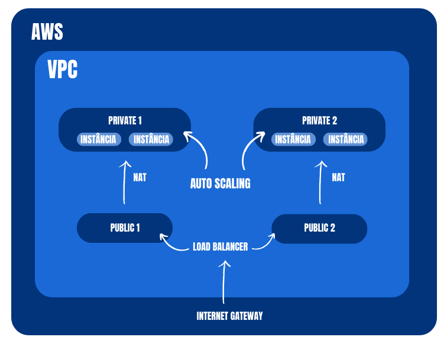
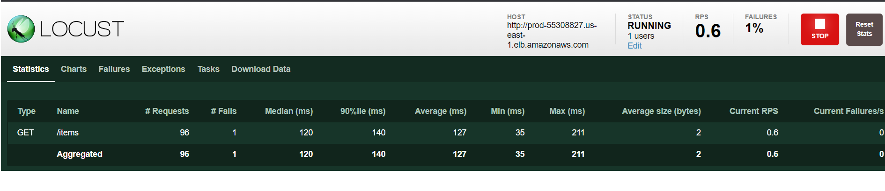

# Implementação de Arquitetura Cloud na AWS com Terraform

O objetivo do projeto é provisionar uma arquitetura na AWS utilizando o Terraform, que englobe o uso de um Application Load Balancer (ALB), instâncias EC2 com Auto Scaling e um banco de dados RDS.

# Região

A Nuvem AWS abrange 102 zonas de disponibilidade em 32 regiões geográficas por todo o mundo, com planos já divulgados para mais 15 zonas de disponibilidade e outras 5 regiões da AWS no Canadá, na Alemanha, na Malásia, na Nova Zelândia e na Tailândia.  

Dito isso, temos uma gama vasta de possíveis regiões a serem escolhida, para este projeto a região escolhida foi a Virgínia do Norte (us-east-1), devido principalmente aos seguintes fatores:

- **Redundância e Resiliência**: A região us-east-1 possui várias zonas de disponibilidade, permitindo a construção de arquiteturas altamente disponíveis e resilientes.
- **Histórico de Confiabilidade**: Devido à sua longa existência, a região us-east-1 tem um histórico comprovado de confiabilidade e estabilidade.

# Infraestrutura da AWS para Ambiente de Produção

Este repositório contém scripts Terraform para criar uma infraestrutura básica na Amazon Web Services (AWS) destinada a um ambiente de produção. A seguir, uma explicação das principais características da configuração:

## Virtual Private Cloud (VPC)

Foi criada uma VPC (Virtual Private Cloud) com o bloco CIDR `10.0.0.0/16`, permitindo a segmentação de recursos de rede. A VPC está configurada para oferecer suporte a resolução DNS e hostnames DNS.

## Sub-redes Públicas

Duas sub-redes públicas foram estabelecidas para alocar recursos que necessitam de acessibilidade direta à internet. Cada sub-rede possui seu bloco CIDR exclusivo (`10.0.1.0/24` e `10.0.2.0/24`) e está associada a uma zona de disponibilidade específica.

## Sub-redes Privadas

Outras duas sub-redes foram configuradas como privadas (`10.0.3.0/24` e `10.0.4.0/24`), destinadas a recursos que não precisam de acesso direto à internet. Cada sub-rede privada está associada a uma zona de disponibilidade.

## Tabelas de Roteamento

Foram criadas tabelas de roteamento separadas para sub-redes públicas e privadas, permitindo um controle preciso sobre o tráfego. As sub-redes estão associadas às tabelas de roteamento correspondentes.

## Gateway de Internet

Um Gateway de Internet foi configurado para fornecer conectividade à internet para as sub-redes públicas. Rotas adequadas foram definidas nas tabelas de roteamento públicas para garantir a rota correta do tráfego.

## Gateway NAT

Um Gateway NAT foi implementado para permitir que instâncias em sub-redes privadas acessem a internet para atualizações e downloads, sem expor diretamente seus endereços IP. Foi associado um endereço IP elástico a este Gateway NAT.

# Balanceador de Carga para Aplicações em Produção

O ALB é como um "tráfego manager" que direciona os pedidos dos usuários para diferentes partes da sua aplicação, garantindo que tudo funcione sem problemas.

## Como Funciona

O ALB escuta o tráfego na porta 80 (usada para acessar sites) e encaminha esses pedidos para a parte correta da sua aplicação. Isso ajuda a manter tudo equilibrado e funcionando sem problemas.

## Segurança do Load Balancer

Há também uma configuração de segurança para garantir que apenas o tráfego necessário seja permitido.

Esta configuração ajuda a garantir que sua aplicação seja escalável, confiável e segura na nuvem da AWS.

# Instâncias EC2

O ambiente é composto por instâncias configuradas para hospedar a aplicação backend. Cada instância é ajustada com as especificações necessárias, como tipo de instância, imagem base e scripts de inicialização.

## Autoscaling

Para lidar com flutuações na carga de trabalho, foi implementado um sistema de escalonamento automático. Isso permite que o número de instâncias seja ajustado dinamicamente por alarmes conforme necessário para manter o desempenho ideal e a eficiência operacional.

Por meio de uma política de escalonamento automático que monitorar a utilização da CPU. Se a utilização ultrapassar um limiar especificado, a política adiciona novas instâncias para distribuir a carga, garantindo uma resposta eficiente mesmo em períodos de tráfego intenso.

## Segurança das instâncias

A segurança é uma prioridade, e a configuração inclui grupos de segurança, políticas IAM e permissões específicas. Essas medidas visam proteger a infraestrutura contra acessos não autorizados, garantindo a integridade dos dados.

# Configuração do Banco de Dados Relacional (RDS)

O Amazon Relational Database Service (RDS) é um serviço gerenciado de bancos de dados da AWS. Ele simplifica a administração de bancos de dados relacionais na nuvem, automatizando tarefas operacionais complexas. Com suporte para vários motores de banco de dados, o RDS oferece facilidade de uso, escalabilidade e segurança integrada. É uma solução eficaz para implementar, operar e escalar bancos de dados na nuvem.

## Grupo de Sub-redes do Banco de Dados

- **Objetivo:** Organizar a localização do banco de dados em sub-redes específicas.
- **Detalhes:** As sub-redes privadas são designadas para hospedar o RDS, proporcionando uma estrutura organizada.

## Instância do Banco de Dados

- **Objetivo:** Configurar a instância do banco de dados.
- **Detalhes:**
  - **Nome e Credenciais:** Define o nome e as credenciais de acesso.
  - **Motor do Banco de Dados:** Utiliza o MySQL.
  - **Tipo de Instância:** Especifica o tipo de hardware da instância.
  - **Armazenamento:** Aloca 20 GB para armazenamento.
  - **Segurança:** Gerencia quem pode acessar o banco de dados.

- **Backup:** Mantém backups por 5 dias para segurança, sem criar um snapshot final.

Essas configurações garantem que o banco de dados seja acessível, seguro e esteja localizado em sub-redes específicas para melhor organização.

# Armazenamento do Estado (Backend):

- **Amazon S3:**
  - O Terraform armazena o estado da infraestrutura no Amazon S3.
  - Utiliza um bucket chamado "bucket-s3-dom" criado manualmente pelo Dashboard da AWS.

# Diagrama da Arquitetura na AWS

# Estimativa de custos

A implementação de todos esses recursos da AWS geraria uma conta de USD 92,36/mês, e pode ser acompanhada melhor neste link da [AWS calculator](https://calculator.aws/#/estimate?id=5821c538e1597be24b49c6095380a7aeb633ce84)

# Utilização e Execução

Antes de da execução de qualquer comando é importante garantir que vc tenha instalado em seu ambiente as dependencias da AWS CLI e do terraform.

Após isso vamos configurar seu ambiente com suas credenciais, lembrando esses são passos executáveis em Windows no POWERSHELL:

<pre>
$ aws configure
AWS Access Key ID [None]: {SUA_ACCESS_KEY}
AWS Secret Access Key [None]: {SUA_SECRET_ACCESS_KEY}
Default region name [None]: us-east-1
Default output format [None]: table
</pre>

Com o ambiente configurado com suas credencias da AWS, proximo passo é criar seu bucket S3 no Dashboard da aws, lembre-se de alterar o arquivo **provider.tf** para que o nome do seu bucket seja o mesmo declarado no arquivo.

Agora antes de começar a execução do terraform, você deverá criar um arquivo .env para declarar algumas variáveis do seu banco de dados, esse passo é opcional, porém garante uma segurança e integridade maior para seu banco de dados, caso não execute esse passo, o banco de dados será criado com um usuario e nome do banco padrões, e você precisará criar a senha durante a execução do terraform.

Conteúdo do arquivo .env

<pre>
TF_VAR_prod_rds_password={senha_do_db}
TF_VAR_prod_rds_username={usuário_do_db}
TF_VAR_prod_rds_db_name={nome_do_db}
</pre>

Com o arquivo já criado, execute os seguintes comando para habilitar seu ambiente com as variáveis do banco.

<pre>
Get-Content .env | ForEach-Object {
    $envVar = $_ -split '=', 2
    [System.Environment]::SetEnvironmentVariable($envVar[0], $envVar[1], [System.EnvironmentVariableTarget]::Process)
}
</pre>

Tudo certo, podemos inicializar nosso aplicação na AWS, execute os comandos a seguir:

<pre>
terraform init
terraform apply
</pre>

A aplicação começará a ser lançada, uma boa hora pra uma pausa enquanto espera a aplicação entrar em funcionamento.

Quando pronta você conseguirá ver como output o dns da aplicação pelo próprio prompt aberto, então acrecentando um "/docs" você verá sua aplicação funcionando perfeitamente.

E por fim caso queria destruir tudo execute:

<pre>
terraform destroy
</pre>

E não verá mais a aplicação em funcionamento da AWS.

# Locust (B+)

Ao finalizar o terraform apply um IP público será disponibilizado também, que se trata do ip que te encaminhará para o locust, ferramenta de teste de carga e desempenho, adicione a porta 8089 ao ip e você terá acesso ao Dashboard do locust.

